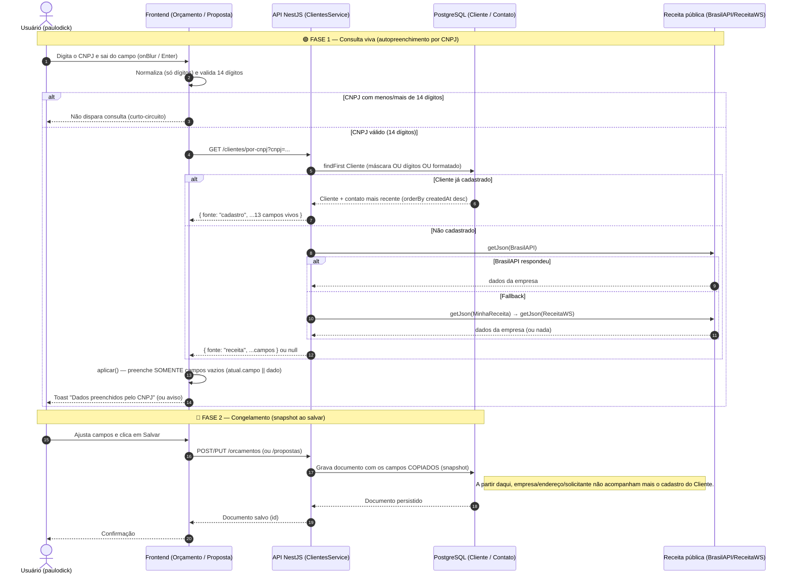
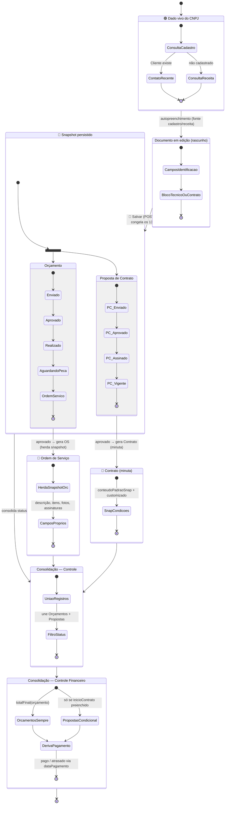

# Ciclo de vida dos dados — do CNPJ à consolidação

Documentação técnica do **Best Medical** que descreve como os dados de um cliente
percorrem o sistema, desde a consulta pelo CNPJ até a consolidação nas telas de
**Controle** e **Controle Financeiro**.

O ponto mais importante deste documento é distinguir **dois modos de dado**:

| Modo | Descrição | Onde ocorre |
| --- | --- | --- |
| 🟢 **Consulta viva** | O dado é lido em tempo real da fonte canônica (base de dados `Cliente`, ou API pública da Receita). Reflete sempre o valor atual. | `GET /clientes/por-cnpj` — usado no **Novo Orçamento** e na **Proposta de Contrato** ao preencher o CNPJ. |
| 🔵 **Snapshot** | O dado é **copiado** para dentro do documento no momento em que ele é salvo. Não se atualiza depois, mesmo que a fonte mude. | Campos de empresa/endereço/solicitante gravados em `Orcamento`, `Proposta` e `OrdemServico`. |

> **Regra de ouro:** a única fonte "viva" é o cadastro do `Cliente` (chave `cnpj`
> `@unique`), consultado no momento do autopreenchimento. A partir do instante em
> que um Orçamento ou Proposta é salvo, seus campos de identificação viram
> snapshots independentes e não acompanham mais alterações no cadastro.

---

## 1. Diagrama de sequência — do CNPJ ao documento salvo

Representa o fluxo de uma requisição de autopreenchimento por CNPJ e a posterior
gravação do documento (Orçamento ou Proposta), evidenciando o momento em que o
dado deixa de ser consulta viva e passa a ser snapshot.

### Leitura do diagrama

- **Passos 5–18 (🟢 consulta viva):** o valor vem direto da base `Cliente` ou da
  Receita naquele instante. Se o cadastro mudar 1 minuto depois, uma nova consulta
  já traz o valor novo.
- **Passos 19–23 (🔵 snapshot):** ao salvar, os 13 campos de identificação são
  gravados como cópia dentro do `Orcamento`/`Proposta`. Alterações posteriores no
  cadastro do `Cliente` **não** se propagam para documentos já salvos.
- O `aplicar()` no frontend nunca sobrescreve o que o usuário já digitou
  (`atual.campo || dado`), preservando edições manuais.

---

## 2. Diagrama de estados — ciclo de vida do dado até a consolidação

Representa os estados pelos quais um registro passa, do dado vivo do CNPJ até a
consolidação em Controle e Controle Financeiro. As transições destacam onde há
snapshot (cópia congelada) e onde há consulta viva.

### Leitura do diagrama

- **🟢 Dado vivo do CNPJ:** único momento em que o valor é lido em tempo real
  (base `Cliente` → contato mais recente, ou Receita pública como fallback).
- **🔵 Snapshot persistido:** ao salvar, os 13 campos de identificação viram cópia.
  Orçamento e Proposta seguem trilhas de status próprias.
- **Herança de snapshot:** a **OS herda o snapshot do Orçamento** (mais campos
  técnicos próprios); o **Contrato herda o snapshot da Proposta** (mais cláusulas).
  Nenhum deles volta a consultar o cadastro vivo.
- **Consolidação:** Controle e Controle Financeiro apenas **unem** os documentos
  já existentes. O Controle Financeiro inclui Orçamentos sempre, mas Propostas
  **somente após `inicioContrato` preenchido**, e deriva `pago`/`atrasado` de
  `dataPagamento`.

---

## 3. Tabela-resumo — vivo vs. snapshot por campo

| Grupo de campos | Novo Orçamento | Proposta | OS | Contrato | Modo |
| --- | :---: | :---: | :---: | :---: | --- |
| Identificação (empresa, cnpj) | copiado | copiado | herdado | herdado | 🔵 snapshot |
| Endereço (cep, endereco, número, complemento, bairro, cidade, estado, país) | copiado | copiado | herdado | — | 🔵 snapshot |
| Solicitante (nome, setor, telefone, email) | copiado | copiado | herdado | — | 🔵 snapshot |
| Consulta por CNPJ (`/clientes/por-cnpj`) | 🟢 vivo | 🟢 vivo | — | — | 🟢 consulta viva |
| Bloco técnico (modalidade, marca, modelo, nº série) | próprio | via equipamentos | herdado do orçamento | — | 🔵 snapshot |
| Condições do contrato | — | próprio | — | snap + customizado | 🔵 snapshot |
| Financeiro (subtotal, desconto, total, parcelas) | calculado | calculado | — | — | derivado |
| Status (Controle) | próprio | próprio | — | — | vivo por documento |

---

## 4. Observações de arquitetura

1. **Snapshots são intencionais:** garantem que um orçamento antigo preserve o
   endereço/contato usados na época, mesmo que o cliente mude de sede depois.
2. **Ponto único de dado vivo:** o cadastro do `Cliente` (chave `cnpj @unique`).
   Como há um único registro por empresa, o autopreenchimento é determinístico —
   sempre devolve o endereço canônico atual e o contato mais recente.
3. **Implicação prática:** para "atualizar" os dados de um documento já salvo após
   uma mudança de cadastro, é preciso reabrir o documento e reexecutar a consulta
   por CNPJ (ou editar os campos manualmente). Não há sincronização automática.
4. **Cobertura de testes:** o comportamento da consulta viva por CNPJ (casos de
   borda, normalização de máscara e resolução determinística) é protegido pela
   suíte de integração `src/clientes/clientes.service.spec.ts`, executada na CI.
